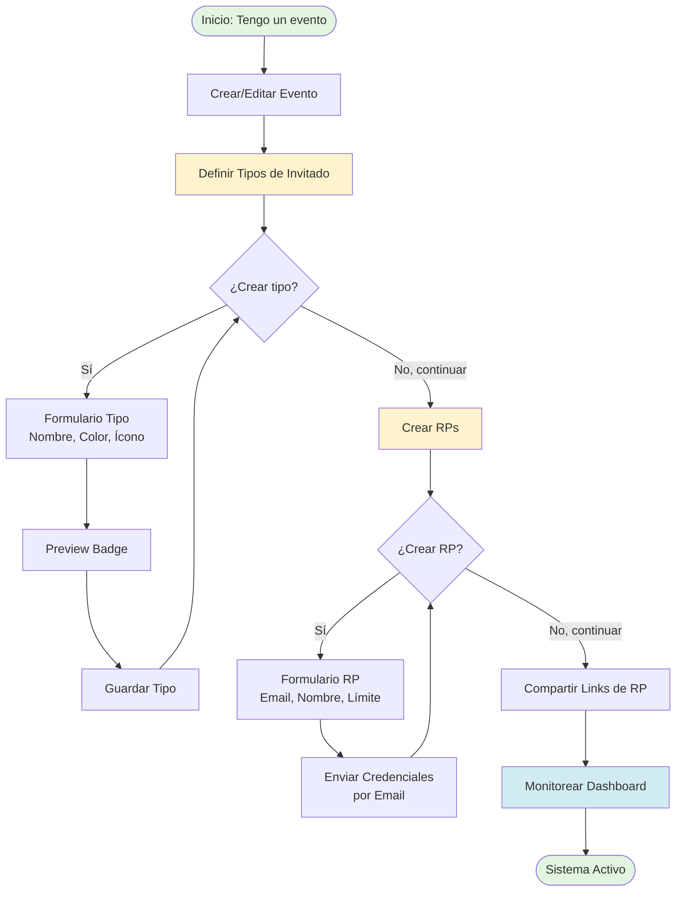
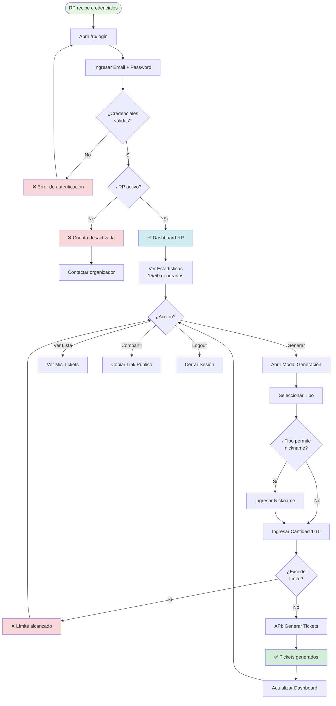
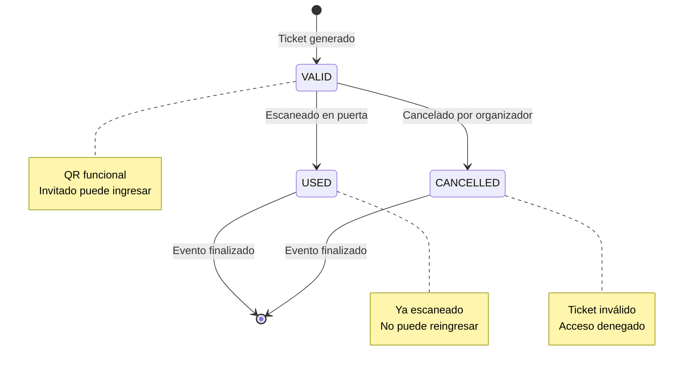
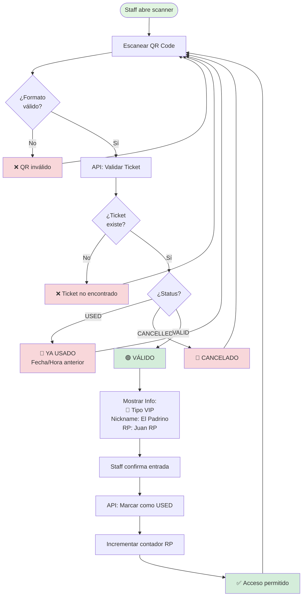
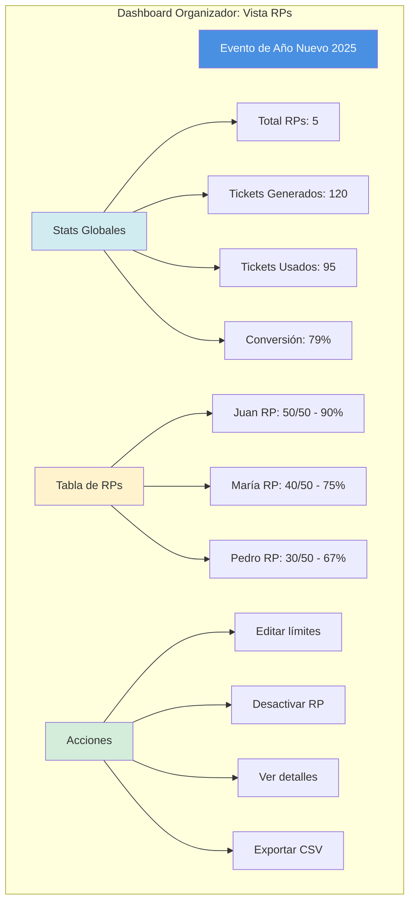
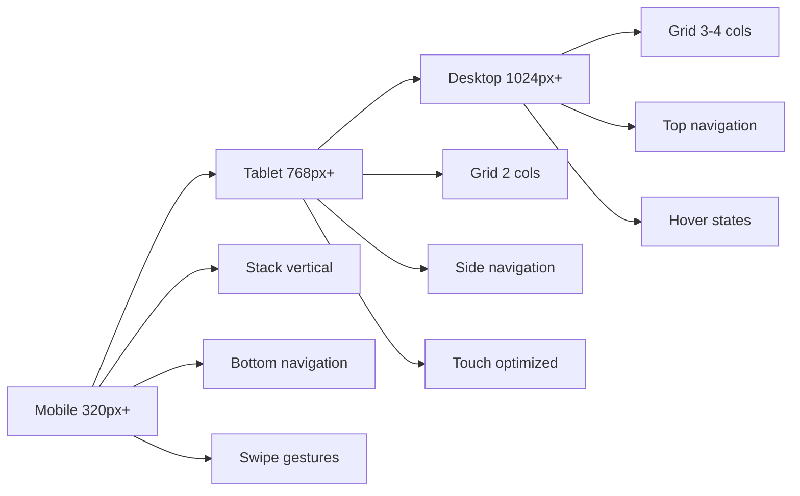

# 🎨 Flujos UX - MonoMarket Tickets V2

**Proyecto:** MonoMarket Tickets V2  
**Audiencia:** Diseñadores UX, Product Owners, Desarrolladores  
**Última Actualización:** 2025-12-17  

---

## 📋 Índice de Flujos

1. [Flujo Organizador: Setup Sistema RP](#flujo-1-organizador-setup-sistema-rp)
2. [Flujo RP: Login y Generación](#flujo-2-rp-login-y-generación)
3. [Flujo Invitado: Reclamar Ticket](#flujo-3-invitado-reclamar-ticket)
4. [Flujo Staff: Escaneo Enhanced](#flujo-4-staff-escaneo-enhanced)
5. [Flujo Organizador: Monitoreo RPs](#flujo-5-organizador-monitoreo-rps)

---

## Flujo 1: Organizador Setup Sistema RP

### Diagrama de Flujo General



### Wireframes: Crear Tipo de Invitado

```
┌─────────────────────────────────────────────────────────┐
│ Modal: Nuevo Tipo de Invitado                     [×]  │
├─────────────────────────────────────────────────────────┤
│                                                         │
│  Nombre *                                               │
│  ┌────────────────────────────────────────────────┐    │
│  │ VIP                                            │    │
│  └────────────────────────────────────────────────┘    │
│                                                         │
│  Color *                      Ícono *                   │
│  ┌──────────┐                ┌──────────┐              │
│  │ #FFD700  │ [Picker]       │   👑     │ [Selector]  │
│  └──────────┘                └──────────┘              │
│                                                         │
│  ☑ Mostrar nickname en PDF                             │
│                                                         │
│  Descripción (opcional)                                │
│  ┌────────────────────────────────────────────────┐    │
│  │ Very Important Person                          │    │
│  └────────────────────────────────────────────────┘    │
│                                                         │
│  ┌──────────── Preview ────────────┐                   │
│  │                                  │                   │
│  │  ┌──────────────────┐            │                   │
│  │  │ 👑 VIP           │            │                   │
│  │  └──────────────────┘            │                   │
│  │  Background: #FFD700             │                   │
│  │                                  │                   │
│  └──────────────────────────────────┘                   │
│                                                         │
│              [Cancelar]  [Guardar Tipo]                │
└─────────────────────────────────────────────────────────┘
```

### Journey Map: Organizador

```mermaid
journey
    title Journey Map: Organizador Crea Sistema RP
    section Preparación
      Crear evento en sistema: 5: Organizador
      Subir imagen del evento: 4: Organizador
    section Configuración Tipos
      Pensar tipos de invitados: 3: Organizador
      Crear tipo VIP: 5: Organizador
      Crear tipo Influencer: 5: Organizador
      Crear tipo Prensa: 5: Organizador
    section Configuración RPs
      Listar RPs a invitar: 4: Organizador
      Crear perfil RP #1: 5: Organizador
      Asignar límite 50 tickets: 5: Organizador
      Enviar credenciales: 5: Sistema
    section Activación
      Compartir link con RP: 4: Organizador
      Monitorear dashboard: 5: Organizador
```

---

## Flujo 2: RP Login y Generación

### Diagrama de Decisión



### Wireframes: Dashboard RP

```
┌──────────────────────────────────────────────────────────────┐
│  MonoMarket RP                        Juan RP  [Logout]      │
├──────────────────────────────────────────────────────────────┤
│                                                              │
│  🎉 Evento de Año Nuevo 2025                                │
│  📅 31 de Diciembre · 🕐 22:00 hrs · 📍 Nightclub XYZ      │
│                                                              │
├──────────────────────────────────────────────────────────────┤
│                                                              │
│  ┌─────────────┐  ┌─────────────┐  ┌─────────────┐         │
│  │ Generados   │  │ Usados      │  │ Conversión  │         │
│  │             │  │             │  │             │         │
│  │   15/50     │  │     12      │  │     80%     │         │
│  │   ▓▓▓▓░ 30% │  │             │  │   ████░     │         │
│  └─────────────┘  └─────────────┘  └─────────────┘         │
│                                                              │
│  ┌─────────────────────────────────────────────────────┐    │
│  │ Breakdown por Tipo                                  │    │
│  ├─────────────────────────────────────────────────────┤    │
│  │  👑 VIP           Generados: 8    Usados: 7        │    │
│  │  🌟 Influencer     Generados: 4    Usados: 3        │    │
│  │  📸 Prensa         Generados: 3    Usados: 2        │    │
│  └─────────────────────────────────────────────────────┘    │
│                                                              │
│  ┌──────────────────────────────────────────────┐           │
│  │  🎟️ Generar Nuevo Ticket                     │           │
│  └──────────────────────────────────────────────┘           │
│                                                              │
│  ┌──────────────────────────────────────────────┐           │
│  │  📋 Ver Todos Mis Tickets                    │           │
│  └──────────────────────────────────────────────┘           │
│                                                              │
│  ┌──────────────────────────────────────────────┐           │
│  │  🔗 Mi Link Público                          │           │
│  │  monomarket.com/rp/ABC123/ticket   [Copiar]  │           │
│  └──────────────────────────────────────────────┘           │
│                                                              │
└──────────────────────────────────────────────────────────────┘
```

### Wireframes: Modal Generar Ticket

```
┌─────────────────────────────────────────────────────────┐
│ Generar Ticket                                     [×]  │
├─────────────────────────────────────────────────────────┤
│                                                         │
│  Tipo de Invitado *                                     │
│  ┌────────────────────────────────────────────────┐    │
│  │ 👑 VIP                                    [▼]  │    │
│  └────────────────────────────────────────────────┘    │
│                                                         │
│  ┌──────────────────┐                                  │
│  │ 👑 VIP           │ ← Preview con color #FFD700      │
│  └──────────────────┘                                  │
│                                                         │
│  Nickname del Invitado                                 │
│  ┌────────────────────────────────────────────────┐    │
│  │ El Padrino                                     │    │
│  └────────────────────────────────────────────────┘    │
│  ℹ️ Se mostrará en el PDF del boleto                   │
│                                                         │
│  Cantidad                                              │
│  ┌──────┐                                              │
│  │  1   │ [- +]  Máximo 10 tickets                    │
│  └──────┘                                              │
│                                                         │
│  ┌────────────────────────────────────────────────┐    │
│  │ 💡 Generarás 1 ticket VIP                      │    │
│  │    Te quedarán 34 de 50 disponibles            │    │
│  └────────────────────────────────────────────────┘    │
│                                                         │
│              [Cancelar]  [Generar Ticket]              │
└─────────────────────────────────────────────────────────┘
```

---

## Flujo 3: Invitado Reclamar Ticket

### Diagrama de Flujo Detallado

```mermaid
flowchart TD
    Start([Invitado recibe link]) --> ClickLink[Click en<br/>monomarket.com/rp/ABC123/ticket]
    ClickLink --> LoadPage[Cargar Landing Pública]
    
    LoadPage --> CheckRP{¿RP activo<br/>y con cuota?}
    CheckRP -->|No activo| ErrorInactive[❌ RP desactivado]
    CheckRP -->|Sin cuota| ErrorLimit[❌ Límite alcanzado]
    CheckRP -->|OK| ShowLanding[✅ Mostrar Landing]
    
    ShowLanding --> ViewInfo[Ver Info Evento<br/>Fecha, Lugar, Progreso]
    ViewInfo --> FillForm[Llenar Formulario<br/>Nombre, Email, Teléfono]
    
    FillForm --> ValidateForm{¿Datos<br/>válidos?}
    ValidateForm -->|No| ErrorForm[❌ Errores de validación]
    ErrorForm --> FillForm
    
    ValidateForm -->|Sí| SolveCaptcha[Resolver CAPTCHA]
    SolveCaptcha --> Submit[Click "Generar Boleto"]
    
    Submit --> CheckDuplicate{¿Email ya<br/>usado?}
    CheckDuplicate -->|Sí| ErrorDupe[❌ Email duplicado]
    ErrorDupe --> FillForm
    
    CheckDuplicate -->|No| CreateTicket[API: Crear Ticket]
    CreateTicket --> GeneratePDF[Generar PDF con<br/>GuestType + QR]
    GeneratePDF --> DownloadPDF[Descarga Automática PDF]
    
    DownloadPDF --> SendEmail{¿Email<br/>habilitado?}
    SendEmail -->|Sí| EmailCopy[Enviar copia por email]
    SendEmail -->|No| ShowSuccess
    EmailCopy --> ShowSuccess[Pantalla de Éxito]
    
    ShowSuccess --> PreviewQR[Preview del QR]
    PreviewQR --> End([Fin: Boleto generado])
    
    style Start fill:#e1f5e1
    style ShowLanding fill:#d1ecf1
    style ShowSuccess fill:#d4edda
    style End fill:#d4edda
    style ErrorInactive fill:#f8d7da
    style ErrorLimit fill:#f8d7da
    style ErrorForm fill:#f8d7da
    style ErrorDupe fill:#f8d7da
```

### Wireframes: Landing Pública

```
┌──────────────────────────────────────────────────────────────┐
│                    MonoMarket Tickets                        │
└──────────────────────────────────────────────────────────────┘

        ╔══════════════════════════════════════════════╗
        ║                                              ║
        ║         🎉 Evento de Año Nuevo 2025         ║
        ║                                              ║
        ║       Cortesía de Juan RP                   ║
        ║                                              ║
        ╚══════════════════════════════════════════════╝

        ┌────────────────────────────────────────────┐
        │  [     Imagen Cover del Evento     ]       │
        └────────────────────────────────────────────┘

        ┌──────────────┐  ┌──────────────┐
        │ 📅 Fecha     │  │ 🕐 Hora      │
        │              │  │              │
        │ 31 de Dic    │  │ 22:00 hrs    │
        │ 2025         │  │              │
        └──────────────┘  └──────────────┘

        ┌────────────────────────────────────────────┐
        │ 📍 Lugar                                   │
        │                                            │
        │ Nightclub XYZ                              │
        │ Av. Principal 123, Ciudad                  │
        └────────────────────────────────────────────┘

        ┌────────────────────────────────────────────┐
        │ Boletos generados                          │
        │ 15 / 50                                    │
        │ ▓▓▓▓▓▓░░░░░░░░░░░ 30%                     │
        └────────────────────────────────────────────┘

        ╔══════════════════════════════════════════════╗
        ║       Obtén tu Boleto Gratis                ║
        ╠══════════════════════════════════════════════╣
        ║                                              ║
        ║  Nombre Completo *                           ║
        ║  ┌──────────────────────────────────────┐   ║
        ║  │                                      │   ║
        ║  └──────────────────────────────────────┘   ║
        ║                                              ║
        ║  Email *                                     ║
        ║  ┌──────────────────────────────────────┐   ║
        ║  │                                      │   ║
        ║  └──────────────────────────────────────┘   ║
        ║                                              ║
        ║  Teléfono (opcional)                         ║
        ║  ┌──────────────────────────────────────┐   ║
        ║  │                                      │   ║
        ║  └──────────────────────────────────────┘   ║
        ║                                              ║
        ║  [ ] No soy un robot (reCAPTCHA)             ║
        ║                                              ║
        ║  ┌──────────────────────────────────────┐   ║
        ║  │   🎟️ Generar Mi Boleto              │   ║
        ║  └──────────────────────────────────────┘   ║
        ║                                              ║
        ╚══════════════════════════════════════════════╝

        Al generar tu boleto, recibirás un PDF con QR
        único. Guárdalo en tu celular.

        ────────────────────────────────────────────────
        Powered by MonoMarket
```

### Pantalla de Éxito

```
┌──────────────────────────────────────────────────────────────┐
│                    MonoMarket Tickets                        │
└──────────────────────────────────────────────────────────────┘

        ╔══════════════════════════════════════════════╗
        ║                                              ║
        ║                    ✅                        ║
        ║                                              ║
        ║          ¡Boleto Generado!                   ║
        ║                                              ║
        ╚══════════════════════════════════════════════╝

        Tu boleto se ha descargado automáticamente.
        Revisa tu carpeta de descargas.

        ┌────────────────────────────────────────────┐
        │                                            │
        │          [   Preview del QR Code   ]       │
        │                                            │
        │            ████████████████                │
        │            ██          ██                  │
        │            ██  ██████  ██                  │
        │            ██  ██████  ██                  │
        │            ██          ██                  │
        │            ████████████████                │
        │                                            │
        │         RP-abc123def456                    │
        │                                            │
        └────────────────────────────────────────────┘

        📧 Te enviamos una copia a tu email

        ┌────────────────────────────────────────────┐
        │  Instrucciones:                            │
        │  1. Guarda este PDF en tu celular          │
        │  2. Presenta el QR en la entrada           │
        │  3. ¡Disfruta el evento!                   │
        └────────────────────────────────────────────┘

        ¿Problemas? Contacta a Juan RP
```

### Estado Diagrams: Ticket Lifecycle



---

## Flujo 4: Staff Escaneo Enhanced

### Diagrama de Decisión del Scanner



### Wireframes: Pantalla Scanner (Válido)

```
┌──────────────────────────────────────────────────────────────┐
│  MonoMarket Scanner              Staff: María    [Logout]   │
├──────────────────────────────────────────────────────────────┤
│                                                              │
│                                                              │
│                                                              │
│                  🟢                                          │
│                                                              │
│               VÁLIDO                                         │
│                                                              │
│  ╔══════════════════════════════════════════════╗           │
│  ║                                              ║           │
│  ║  Tipo: 👑 VIP                                ║           │
│  ║        ▓▓▓▓▓▓▓▓▓▓▓▓▓▓▓▓▓▓                   ║           │
│  ║        Background: #FFD700                   ║           │
│  ║                                              ║           │
│  ║  Nickname: "El Padrino"                      ║           │
│  ║                                              ║           │
│  ║  Cortesía de: Juan RP                        ║           │
│  ║                                              ║           │
│  ║  QR: RP-abc123def456                         ║           │
│  ║                                              ║           │
│  ╚══════════════════════════════════════════════╝           │
│                                                              │
│  ┌──────────────────────────────────────────────┐           │
│  │          ✅ PERMITIR ENTRADA                 │           │
│  └──────────────────────────────────────────────┘           │
│                                                              │
│                                                              │
│  Último escaneo: 22:30:15                                   │
│  Total escaneados hoy: 147                                  │
│                                                              │
└──────────────────────────────────────────────────────────────┘
```

### Wireframes: Pantalla Scanner (Duplicado)

```
┌──────────────────────────────────────────────────────────────┐
│  MonoMarket Scanner              Staff: María    [Logout]   │
├──────────────────────────────────────────────────────────────┤
│                                                              │
│                                                              │
│                                                              │
│                  🔴                                          │
│                                                              │
│             YA USADO                                         │
│                                                              │
│  ╔══════════════════════════════════════════════╗           │
│  ║                                              ║           │
│  ║  Este ticket ya fue escaneado:               ║           │
│  ║                                              ║           │
│  ║  Fecha: 31 de Diciembre 2025                 ║           │
│  ║  Hora:  22:15:30                             ║           │
│  ║  Por:   Staff María                          ║           │
│  ║                                              ║           │
│  ║  Tipo: 👑 VIP                                ║           │
│  ║  Nickname: "El Padrino"                      ║           │
│  ║                                              ║           │
│  ╚══════════════════════════════════════════════╝           │
│                                                              │
│  ┌──────────────────────────────────────────────┐           │
│  │          ⚠️ DENEGAR ENTRADA                  │           │
│  └──────────────────────────────────────────────┘           │
│                                                              │
│  ┌──────────────────────────────────────────────┐           │
│  │          📞 Reportar Problema                │           │
│  └──────────────────────────────────────────────┘           │
│                                                              │
└──────────────────────────────────────────────────────────────┘
```

---

## Flujo 5: Organizador Monitoreo RPs

### Diagrama de Dashboard



### Wireframes: Dashboard Organizador

```
┌──────────────────────────────────────────────────────────────┐
│  MonoMarket Organizer            Admin Panel    [Logout]    │
├──────────────────────────────────────────────────────────────┤
│                                                              │
│  🎉 Evento de Año Nuevo 2025                                │
│  📅 31 de Diciembre 2025 · 🕐 22:00 hrs                     │
│                                                              │
│  [Info] [Tickets] [RPs] [Scanner] [Analytics]               │
│                                                              │
├──────────────────────────────────────────────────────────────┤
│                                                              │
│  Stats Globales - Sistema RP                                │
│                                                              │
│  ┌──────────┐ ┌──────────┐ ┌──────────┐ ┌──────────┐       │
│  │ RPs      │ │ Generados│ │ Usados   │ │ Conversión│      │
│  │ Activos  │ │          │ │          │ │           │      │
│  │          │ │          │ │          │ │           │      │
│  │    5     │ │   120    │ │    95    │ │    79%    │      │
│  └──────────┘ └──────────┘ └──────────┘ └──────────┘       │
│                                                              │
│  ┌──────────────────────────────────────────────────┐       │
│  │ 🎯 Ranking de RPs                        [Exportar CSV]  │
│  ├──────────────────────────────────────────────────┤       │
│  │ RP          │ Generados │ Usados │ Conv. │ Acciones │    │
│  ├──────────────────────────────────────────────────┤       │
│  │ 👤 Juan RP  │  50/50    │   45   │  90%  │ [⚙️] [❌] │  │
│  │ 👤 María RP │  40/50    │   30   │  75%  │ [⚙️] [❌] │  │
│  │ 👤 Pedro RP │  30/50    │   20   │  67%  │ [⚙️] [❌] │  │
│  │ 👤 Ana RP   │  0/30     │    0   │   0%  │ [⚙️] [❌] │  │
│  │ 👤 Luis RP  │  0/ilim   │    0   │   0%  │ [⚙️] [❌] │  │
│  └──────────────────────────────────────────────────┘       │
│                                                              │
│  ┌──────────────────────────────────────────────────┐       │
│  │ 📊 Breakdown por Tipo de Invitado               │       │
│  ├──────────────────────────────────────────────────┤       │
│  │  👑 VIP         Generados: 50    Usados: 45      │       │
│  │  🌟 Influencer  Generados: 40    Usados: 30      │       │
│  │  📸 Prensa      Generados: 30    Usados: 20      │       │
│  └──────────────────────────────────────────────────┘       │
│                                                              │
│  ┌──────────────────────────────────────────────────┐       │
│  │  ➕ Crear Nuevo RP                               │       │
│  └──────────────────────────────────────────────────┘       │
│                                                              │
└──────────────────────────────────────────────────────────────┘
```

---

## 📱 Responsive Considerations

### Mobile-First Approach



### Breakpoints

| Device | Width | Layout |
|--------|-------|--------|
| Mobile | 320-767px | Single column, bottom nav |
| Tablet | 768-1023px | 2 columns, side drawer |
| Desktop | 1024px+ | 3-4 columns, full dashboard |

---

## 🎨 Design Tokens

### Colors

```css
/* Primary */
--primary-500: #6366F1;      /* Indigo - CTA buttons */
--primary-600: #4F46E5;      /* Hover states */

/* Guest Types */
--guest-vip: #FFD700;        /* Gold */
--guest-influencer: #FF69B4; /* Pink */
--guest-press: #10B981;      /* Green */

/* Status */
--status-valid: #10B981;     /* Green */
--status-used: #EF4444;      /* Red */
--status-cancelled: #9CA3AF; /* Gray */

/* Backgrounds */
--bg-gradient: linear-gradient(135deg, #667eea 0%, #764ba2 100%);
```

### Typography

```css
/* Headlines */
--font-family: 'Inter', system-ui, sans-serif;
--h1: 2.5rem / 3rem;  /* 40px / 48px */
--h2: 2rem / 2.5rem;  /* 32px / 40px */
--h3: 1.5rem / 2rem;  /* 24px / 32px */

/* Body */
--body-lg: 1.125rem / 1.75rem; /* 18px / 28px */
--body: 1rem / 1.5rem;         /* 16px / 24px */
--body-sm: 0.875rem / 1.25rem; /* 14px / 20px */
```

---

## 🔄 Animation Guidelines

### Micro-interactions

```css
/* Smooth transitions */
transition: all 0.3s cubic-bezier(0.4, 0.0, 0.2, 1);

/* Button hover */
.button:hover {
  transform: translateY(-2px);
  box-shadow: 0 10px 20px rgba(0,0,0,0.2);
}

/* Success feedback */
@keyframes success-pulse {
  0%, 100% { transform: scale(1); }
  50% { transform: scale(1.05); }
}
```

### Loading States

- **Skeleton screens** para carga inicial
- **Spinners** para acciones (generar ticket)
- **Progress bars** para uploads
- **Toast notifications** para feedback

---

## ✅ Accessibility Checklist

- [ ] **WCAG 2.1 AA** compliance
- [ ] Color contrast ratio ≥ 4.5:1
- [ ] Keyboard navigation completa
- [ ] Screen reader optimizado (ARIA labels)
- [ ] Focus states visibles
- [ ] Touch targets ≥ 44x44px
- [ ] Text resizable hasta 200%
- [ ] Error messages descriptivos

---

## 📚 Recursos de Diseño

- **Figma:** [Enlace a mockups]
- **Prototipo interactivo:** [Enlace a prototipo]
- **Design System:** [Storybook components]
- **Iconografía:** [Feather Icons](https://feathericons.com/)

---

**Última Actualización:** 2025-12-17  
**Diseñado por:** Equipo UX MonoMarket  
**Versión:** 2.0
