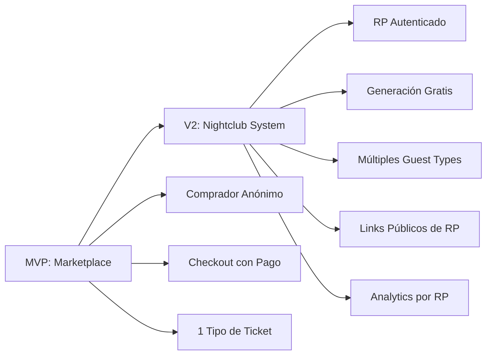
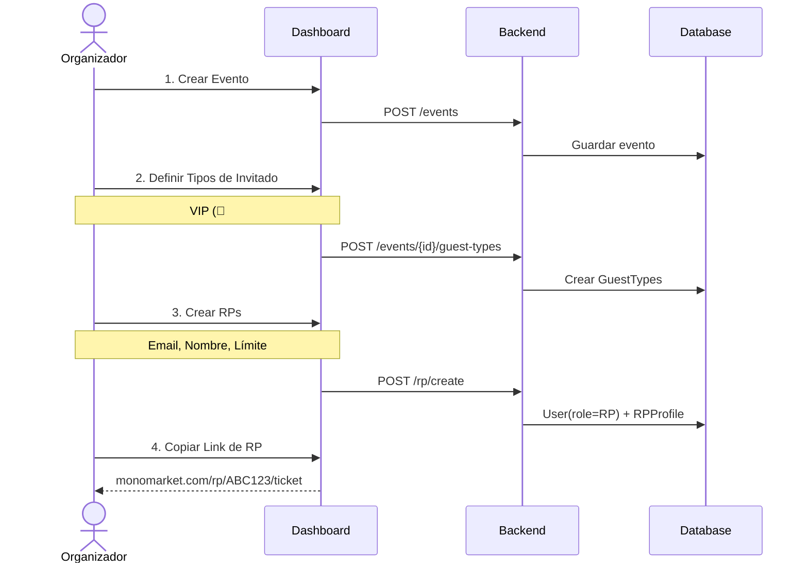
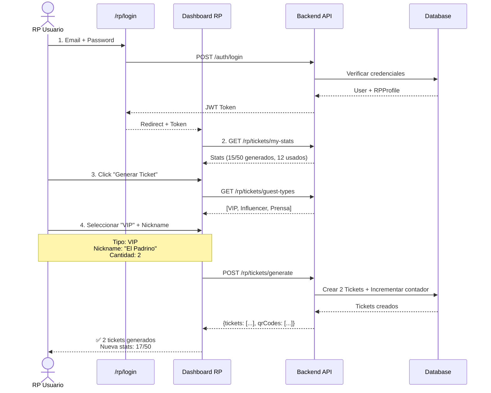
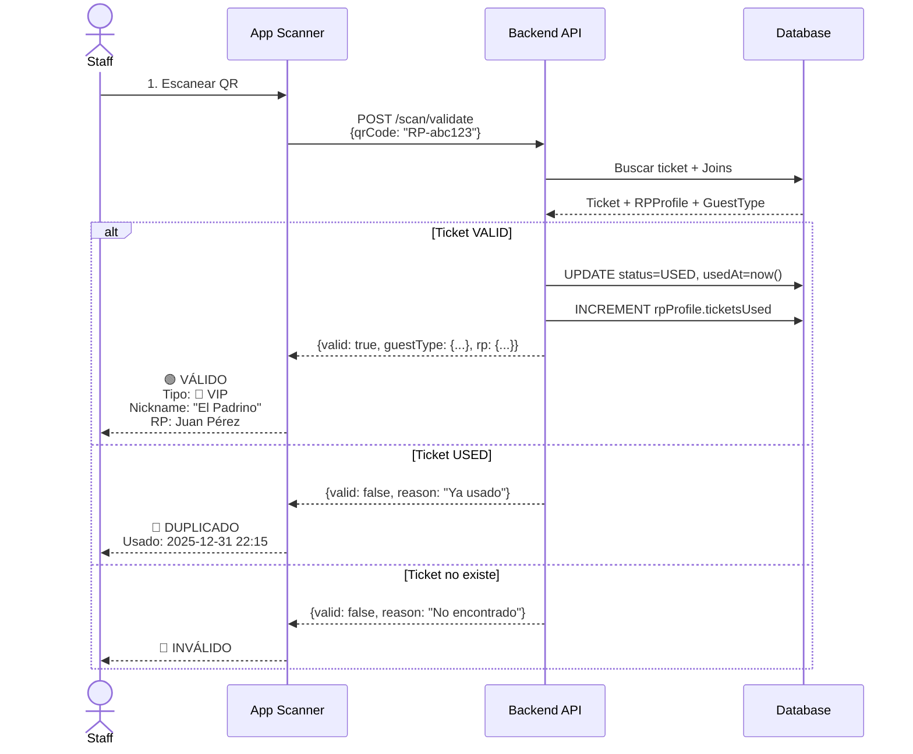

# 🎉 MonoMarket Tickets V2 - Actualización Nightclub System

**Versión:** 2.0  
**Fecha:** 2025-12-17  
**Estado:** En Desarrollo  

---

## 📋 Tabla de Contenidos

1. [Resumen Ejecutivo](#resumen-ejecutivo)
2. [MVP vs V2: Diferencias Clave](#mvp-vs-v2-diferencias-clave)
3. [Nuevas Features V2](#nuevas-features-v2)
4. [Historias de Usuario](#historias-de-usuario)
5. [Flujos UX Detallados](#flujos-ux-detallados)
6. [Arquitectura Técnica](#arquitectura-técnica)
7. [Roadmap de Implementación](#roadmap-de-implementación)

---

## 🎯 Resumen Ejecutivo

**V2** introduce el **Sistema de Relaciones Públicas (RP)** para discotecas y eventos nocturnos, permitiendo que RPs generen boletos de cortesía personalizados para diferentes tipos de invitados (VIP, Influencers, Prensa, etc.).

### Principales Innovaciones

- 🎫 **Sistema RP Multi-Nivel**: RPs autenticados generan tickets con límites configurables
- 👥 **Tipos de Invitados Personalizables**: VIP, Influencer, Prensa con colores e iconos únicos
- 🎨 **PDFs Diferenciados**: Tickets visuales con tipos de invitado y nicknames opcionales
- 📊 **Dashboard RP con Analytics**: Estadísticas de conversión y uso por tipo
- 🔗 **Links Públicos de RP**: URLs compartibles para que invitados reclamen sus tickets

---

## 🔄 MVP vs V2: Diferencias Clave



| Característica | MVP | V2 |
|---|---|---|
| **Modelo de Negocio** | Marketplace de venta de boletos | Sistema de cortesías RP |
| **Usuario Principal** | Comprador anónimo | RP autenticado |
| **Proceso de Adquisición** | Checkout + Pago | Formulario público (gratis) |
| **Tipos de Boletos** | General, VIP (precio) | VIP, Influencer, Prensa (tipo) |
| **Límites** | Stock por evento | Cuota por RP |
| **Analytics** | Ventas globales | Conversión por RP |
| **Personalización PDF** | Nombre del comprador | Tipo + Nickname opcional |

---

## 🚀 Nuevas Features V2

### 1. Sistema de RP (Relaciones Públicas)

#### 🔐 Autenticación de RP
- Login dedicado en `/rp/login`
- Role `RP` en base de datos
- Perfil RP asociado a un evento específico
- Límites configurables de tickets (ej: 50 tickets max)

#### 🎫 Generación de Tickets
- Dashboard RP para generar tickets
- Selección de tipo de invitado (VIP, Influencer, etc.)
- Nickname opcional visible en PDF
- Generación en lote (hasta 10 tickets simultáneos)
- QR único por ticket con prefijo `RP-{uuid}`

#### 📊 Dashboard RP
- **Estadísticas generales:**
  - Tickets generados vs límite
  - Tickets usados (escaneados)
  - Tasa de conversión (uso/generados)
- **Breakdown por tipo:**
  - Generados, usados y válidos por tipo de invitado
  - Visualización con colores personalizados
- **Listado de tickets:**
  - Filtros por estado (VALID, USED, CANCELLED)
  - Filtros por tipo de invitado

### 2. Tipos de Invitados (Guest Types)

#### 🎨 Personalización Visual
```typescript
interface GuestType {
  name: string;          // "VIP", "Influencer", "Prensa"
  description?: string;  // "Very Important Person"
  color: string;         // "#FFD700" (oro para VIP)
  icon: string;          // "👑", "🌟", "📸"
  showNicknameOnPdf: boolean; // true para VIP/Prensa
  displayOrder: number;  // Orden de visualización
}
```

#### 📋 Ejemplos Precargados (Seed)
- **👑 VIP** - #FFD700 (oro) - Muestra nickname
- **🌟 Influencer** - #FF69B4 (rosa) - Sin nickname
- **📸 Prensa** - #10B981 (verde) - Muestra nickname

### 3. Sistema Público de Captura

#### 🔗 URL Pública de RP
```
monomarket.com/rp/{rpCode}/ticket
```

- **Landing page pública** sin autenticación
- **Formulario simple:**
  - Nombre completo
  - Email
  - Teléfono (opcional)
- **Descarga automática de PDF** tras validación
- **Progreso visible**: Muestra X/Y tickets generados
- **Branding personalizado**: "Cortesía de {Nombre del RP}"

---

## 👥 Historias de Usuario

### 🎭 Rol: Organizador (Nightclub Owner)

#### HU-ORG-01: Crear Tipos de Invitados
> **Como** organizador de discoteca  
> **Quiero** definir tipos de invitados personalizados  
> **Para** diferenciar VIPs, Influencers y Prensa en mi evento

**Criterios de Aceptación:**
- ✅ Crear tipo con nombre, color, ícono y descripción
- ✅ Definir si el tipo muestra nickname en PDF
- ✅ Ordenar tipos por prioridad visual
- ✅ Ver preview de cómo se verá en el ticket PDF

**Prioridad:** Alta  
**Complejidad:** Media  

---

#### HU-ORG-02: Crear RPs y Asignar Cuotas
> **Como** organizador  
> **Quiero** registrar a mis RPs y asignarles límites de tickets  
> **Para** controlar cuántos invitados trae cada uno

**Criterios de Aceptación:**
- ✅ Crear usuario con role RP
- ✅ Asociar RP a un evento específico
- ✅ Definir límite de tickets (o ilimitado)
- ✅ Activar/desactivar RP en cualquier momento
- ✅ Ver lista de todos los RPs del evento

**Prioridad:** Alta  
**Complejidad:** Media  

---

#### HU-ORG-03: Monitorear Performance de RPs
> **Como** organizador  
> **Quiero** ver estadísticas de cada RP  
> **Para** saber quién trae más invitados y su tasa de conversión

**Criterios de Aceptación:**
- ✅ Dashboard global con todos los RPs
- ✅ Ver tickets generados/usados por RP
- ✅ Ver tasa de conversión (usados/generados)
- ✅ Filtrar por tipo de invitado
- ✅ Exportar reporte en CSV

**Prioridad:** Media  
**Complejidad:** Alta  

---

### 🎪 Rol: RP (Relaciones Públicas)

#### HU-RP-01: Login en el Sistema
> **Como** RP  
> **Quiero** autenticarme con mis credenciales  
> **Para** acceder a mi dashboard de tickets

**Criterios de Aceptación:**
- ✅ Login en `/rp/login` con email/password
- ✅ Redirección a dashboard tras login exitoso
- ✅ Mensaje de error si credenciales incorrectas
- ✅ Logout seguro

**Prioridad:** Alta  
**Complejidad:** Baja  

---

#### HU-RP-02: Generar Ticket de Invitado (Dashboard)
> **Como** RP autenticado  
> **Quiero** generar tickets para mis invitados desde mi dashboard  
> **Para** controlar quién viene a mi mesa

**Criterios de Aceptación:**
- ✅ Seleccionar tipo de invitado (VIP, Influencer, etc.)
- ✅ Ingresar nickname si el tipo lo permite
- ✅ Generar de 1 a 10 tickets a la vez
- ✅ Ver confirmación con QR generado
- ✅ Respetar mi límite de tickets
- ✅ Mensaje de error si alcanzo límite

**Prioridad:** Alta  
**Complejidad:** Media  

---

#### HU-RP-03: Ver Mis Estadísticas
> **Como** RP  
> **Quiero** ver mis estadísticas de generación y uso  
> **Para** saber cuántos invitados confirmados tengo

**Criterios de Aceptación:**
- ✅ Ver tickets generados vs límite
- ✅ Ver tickets usados (ya escaneados)
- ✅ Ver tasa de conversión en %
- ✅ Breakdown por tipo de invitado
- ✅ Actualización en tiempo real

**Prioridad:** Media  
**Complejidad:** Media  

---

#### HU-RP-04: Compartir Link Público
> **Como** RP  
> **Quiero** compartir un link único por WhatsApp  
> **Para** que mis invitados reclamen su ticket sin que yo lo haga

**Criterios de Aceptación:**
- ✅ Generar link único `/rp/{myCode}/ticket`
- ✅ Link funciona sin autenticación
- ✅ Copiar link con un clic
- ✅ Contador de tickets generados vía link
- ✅ Link desactivado si RP está inactivo

**Prioridad:** Alta  
**Complejidad:** Media  

---

### 🎟️ Rol: Invitado (Guest)

#### HU-GUEST-01: Reclamar Ticket desde Link Público
> **Como** invitado  
> **Quiero** ingresar mis datos en un formulario simple  
> **Para** descargar mi ticket de cortesía

**Criterios de Aceptación:**
- ✅ Acceder a URL pública sin login
- ✅ Ver info del evento (fecha, lugar, hora)
- ✅ Ver nombre del RP que invita
- ✅ Llenar formulario (nombre, email, teléfono opcional)
- ✅ Descarga automática de PDF
- ✅ Email con copia del PDF (opcional)
- ✅ Ver contador de tickets disponibles

**Prioridad:** Alta  
**Complejidad:** Media  

---

#### HU-GUEST-02: Recibir Ticket Personalizado
> **Como** invitado VIP  
> **Quiero** ver mi tipo de invitado y nickname en el PDF  
> **Para** sentirme especial al llegar

**Criterios de Aceptación:**
- ✅ PDF muestra tipo de invitado con ícono y color
- ✅ Nickname visible si el tipo lo permite
- ✅ QR único y escaneable
- ✅ Info del evento completa
- ✅ Diseño profesional y atractivo

**Prioridad:** Media  
**Complejidad:** Alta  

---

### 📱 Rol: Staff (Scanner)

#### HU-STAFF-01: Escanear Tickets RP
> **Como** staff en puerta  
> **Quiero** escanear tickets de RP  
> **Para** validar y ver el tipo de invitado

**Criterios de Aceptación:**
- ✅ Escaneo QR funciona con tickets RP
- ✅ Muestra tipo de invitado (VIP, Influencer, etc.)
- ✅ Muestra nickname si existe
- ✅ Muestra nombre del RP que generó
- ✅ Prevención de duplicados
- ✅ Señal visual verde/rojo

**Prioridad:** Alta  
**Complejidad:** Media  

---

## 🎨 Flujos UX Detallados

### Flujo 1: Organizador Configura Sistema RP



**Pasos Detallados:**

1. **Crear Evento** (Existente en MVP)
   - Título, fecha, lugar, capacidad
   
2. **Definir Tipos de Invitado** (NUEVO V2)
   - Click en "Gestionar Tipos de Invitado"
   - Formulario modal:
     - Nombre (ej: "VIP")
     - Color (color picker)
     - Ícono (emoji selector)
     - ¿Mostrar nickname? (checkbox)
   - Preview en vivo del ticket
   - Guardar y crear otro
   
3. **Crear RPs** (NUEVO V2)
   - Click en "Gestionar RPs"
   - Formulario:
     - Email del RP
     - Nombre completo
     - Límite de tickets (número o "ilimitado")
   - Sistema envía email con credenciales
   - RP aparece en lista con estado ACTIVO
   
4. **Compartir Link a RPs**
   - Ver link único de cada RP
   - Botón "Copiar Link"
   - RP recibe link por email/WhatsApp

---

### Flujo 2: RP Genera Tickets (Dashboard Autenticado)



**Pasos Detallados:**

1. **Login**
   - Página `/rp/login` con branding del evento
   - Formulario email/password
   - Validación de role RP
   - Redirección a dashboard

2. **Ver Dashboard**
   - **Header:** Nombre del RP + Evento
   - **Stats Cards:**
     - Generados: 15/50 (30%)
     - Usados: 12 (80% conversión)
     - Válidos: 3
   - **Gráfica:** Breakdown por tipo
   - **Botón destacado:** "Generar Ticket"

3. **Modal de Generación**
   - Dropdown tipos de invitado (con preview de color/ícono)
   - Input nickname (solo si tipo lo permite)
   - Selector cantidad (1-10)
   - Preview en vivo del ticket
   - Botón "Generar"

4. **Confirmación**
   - Toast success con QR codes
   - Actualización automática de stats
   - Opción de descargar PDFs

---

### Flujo 3: Invitado Reclama Ticket (Link Público)

```mermaid
sequenceDiagram
    actor Guest as Invitado
    participant Link as /rp/{code}/ticket
    participant API as Backend API
    participant PDF as PDF Generator
    participant Email as Email Service

    Guest->>Link: 1. Click en link compartido
    Link->>API: GET /rp/public/{code}
    API-->>Link: Info RP + Evento + Progreso (15/50)
    
    Note over Link: Formulario público<br/>Nombre, Email, Teléfono
    
    Guest->>Link: 2. Llenar formulario
    Link->>API: POST /rp/public/{code}/claim
    
    API->>API: Validar RP activo + límite
    API->>API: Crear Ticket (status=VALID)
    
    API->>PDF: Generar PDF con GuestType
    PDF-->>API: ticket.pdf (con tipo VIP)
    
    API-->>Link: {pdfUrl: "...", success: true}
    Link-->>Guest: Descarga automática PDF
    
    opt Email habilitado
        API->>Email: Enviar copia por email
        Email-->>Guest: Email con PDF adjunto
    end
    
    Link-->>Guest: Pantalla confirmación ✅
```

**Pasos Detallados:**

1. **Landing Page Pública**
   - **Header:** Logo del evento + título
   - **Info visual:**
     - 📅 Fecha: 31 de Diciembre 2025
     - 🕐 Hora: 22:00 hrs
     - 📍 Lugar: Nightclub XYZ
   - **Branding RP:**
     - "Cortesía de [Nombre del RP]"
     - Avatar/foto del RP (opcional)
   - **Progress bar:**
     - "15 de 50 boletos generados"
   - **Formulario:**
     - Nombre completo *
     - Email *
     - Teléfono (opcional)
   - **CTA:** Botón grande "🎟️ Obtener Mi Boleto"

2. **Validación**
   - Verificar RP activo
   - Verificar límite no alcanzado
   - Validar formato email

3. **Generación y Descarga**
   - PDF genera con tipo de invitado predeterminado (configurable)
   - Descarga automática
   - Pantalla de éxito:
     - ✅ ¡Boleto Generado!
     - "Revisa tu carpeta de descargas"
     - "Te enviamos copia a tu email"
     - Preview del QR

4. **Post-Generación**
   - Email confirmación con PDF adjunto
   - Instrucciones: "Presenta tu QR en la entrada"
   - Contacto del RP en caso de problemas

---

### Flujo 4: Staff Escanea Ticket RP en Puerta



**Pasos Detallados:**

1. **Escaneo QR**
   - App scanner detecta QR con prefix `RP-`
   - Vibración háptica
   - Envío a API

2. **Validación Backend**
   - Buscar ticket por qrCode
   - Verificar status = VALID
   - Cargar relaciones (GuestType, RPProfile)

3. **Pantalla de Resultado** (VÁLIDO)
   - **Fondo verde** con animación
   - **Información destacada:**
     - 🟢 VÁLIDO
     - Tipo: 👑 VIP (fondo dorado)
     - Nickname: "El Padrino" (grande)
     - Invitado por: Juan Pérez (RP)
   - **Botón:** "Marcar como Usado"
   - **Actualización:** status → USED, usedAt → now()

4. **Pantalla de Resultado** (INVÁLIDO)
   - **Fondo rojo**
   - Razón del rechazo
   - Opción de reportar

---

## 🏗️ Arquitectura Técnica

### Stack Tecnológico

**Backend (NestJS):**
- `apps/api/src/modules/rp/` - Módulo RP
  - `rp-tickets-v2.controller.ts` - Endpoints RP autenticados
  - `rp-tickets-v2.service.ts` - Lógica de negocio
  - `rp-public.controller.ts` - Endpoints públicos
- Guards: `JwtAuthGuard` + `RolesGuard('RP')`

**Frontend (React + Vite):**
- `apps/web/src/pages/rp/RPLogin.tsx` - Login RP
- `apps/web/src/pages/rp/RPDashboard.tsx` - Dashboard RP
- `apps/web/src/pages/public/RPTicketGenerator.tsx` - Landing pública
- `apps/web/src/components/rp/GenerateTicketModal.tsx` - Modal generación

**Base de Datos (PostgreSQL + Prisma):**
```prisma
model RPProfile {
  id               String
  userId           String   @unique
  eventId          String
  maxTickets       Int?     // null = ilimitado
  ticketsGenerated Int      @default(0)
  ticketsUsed      Int      @default(0)
  isActive         Boolean  @default(true)
  
  user    User
  event   Event
  tickets Ticket[]
}

model GuestType {
  id                String
  eventId           String
  name              String
  color             String?
  icon              String?
  showNicknameOnPdf Boolean  @default(false)
  displayOrder      Int      @default(0)
  
  tickets Ticket[]
}
```

### Endpoints API

**Autenticados (Bearer Token, Role=RP):**
```
POST   /api/rp/tickets/generate
GET    /api/rp/tickets/my-tickets
GET    /api/rp/tickets/my-stats
GET    /api/rp/tickets/guest-types
```

**Públicos:**
```
GET    /api/rp/public/{rpCode}
POST   /api/rp/public/{rpCode}/claim
GET    /api/rp/public/{rpCode}/ticket.pdf
```

---

## 📅 Roadmap de Implementación

### ✅ Fase 1: Backend Foundation (COMPLETADO)
**Duración:** 2 semanas  
**Estado:** 100%

- [x] Migración DB con `RPProfile` y `GuestType`
- [x] Seed V2 con datos de prueba
- [x] Controller y Service RP autenticado
- [x] Endpoints de generación y stats
- [x] Tests unitarios del service

---

### 🚧 Fase 2: Frontend RP Dashboard (EN PROGRESO)
**Duración:** 2 semanas  
**Estado:** 60%

- [x] RPLogin page
- [x] GenerateTicketModal component
- [ ] RPDashboard completo con stats
- [ ] Listado de tickets con filtros
- [ ] Gráficas de conversión
- [ ] Responsive design

---

### 📝 Fase 3: Landing Pública (PLANIFICADO)
**Duración:** 1.5 semanas  
**Estado:** 40%

- [x] RPTicketGenerator page básica
- [ ] Validación de límites en tiempo real
- [ ] Integración con PDF Generator
- [ ] Email confirmación
- [ ] Captcha anti-bots
- [ ] Multi-idioma (ES/EN)

---

### 🎨 Fase 4: PDF Personalizado (PLANIFICADO)
**Duración:** 1 semana  
**Estado:** 0%

- [ ] Template PDF con GuestType visual
- [ ] Colores dinámicos según tipo
- [ ] Nickname destacado
- [ ] QR optimizado
- [ ] Preview en dashboard

---

### 📊 Fase 5: Analytics Avanzado (FUTURO)
**Duración:** 2 semanas  
**Estado:** 0%

- [ ] Dashboard organizador con todos los RPs
- [ ] Comparativa de RPs (ranking)
- [ ] Exportación CSV/Excel
- [ ] Gráficas temporales (tickets por hora)
- [ ] Predicción de asistencia

---

### 🔔 Fase 6: Notificaciones (FUTURO)
**Duración:** 1 semana  
**Estado:** 0%

- [ ] WhatsApp confirmación (Twilio)
- [ ] SMS recordatorio día del evento
- [ ] Email marketing previo
- [ ] Push notifications en app

---

## 🎯 Métricas de Éxito V2

| Métrica | Objetivo | Actual |
|---------|----------|--------|
| RPs activos por evento | \> 10 | - |
| Tickets generados por RP | 30-50 | - |
| Tasa de conversión (uso/generados) | \> 70% | - |
| Tiempo promedio de generación | \< 30 seg | - |
| Satisfacción de invitados | \> 4.5/5 | - |

---

## ⚠️ Consideraciones de Seguridad

### Prevención de Abuso

1. **Rate Limiting:**
   - Máximo 10 tickets por minuto por RP
   - Máximo 100 solicitudes/hora desde IP pública

2. **Validaciones:**
   - Email único por RP code (prevenir duplicados)
   - CAPTCHA en formulario público
   - Verificación de RP activo en cada request

3. **Auditoría:**
   - Log de todas las generaciones con IP
   - Tracking de RP que alcanza límite
   - Alertas si conversión \< 30%

---

## 🚀 Deployment

### Variables de Entorno Adicionales

```env
# V2 Features
ENABLE_RP_SYSTEM=true
RP_MAX_TICKETS_DEFAULT=50
RP_LINK_EXPIRATION_DAYS=30
CAPTCHA_SITE_KEY=your_key
CAPTCHA_SECRET_KEY=your_secret
```

### Migración de Base de Datos

```bash
cd apps/api
pnpm prisma migrate deploy
pnpm prisma db seed -- --file=seed-v2-test.ts
```

---

## 📚 Recursos Adicionales

- [MVP.md](./MVP.md) - Especificación original del MVP
- [FASE1-COMPLETE.md](./FASE1-COMPLETE.md) - Mejoras de seguridad
- [USER-STORIES.md](./USER-STORIES.md) - Historias de usuario completas (próximamente)
- [API-DOCS.md](./docs/API-DOCS.md) - Documentación OpenAPI

---

**Última Actualización:** 2025-12-17  
**Autor:** Equipo MonoMarket  
**Status:** 🚧 En Desarrollo Activo
